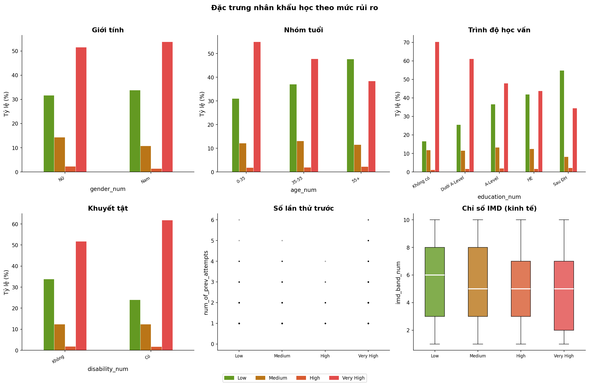
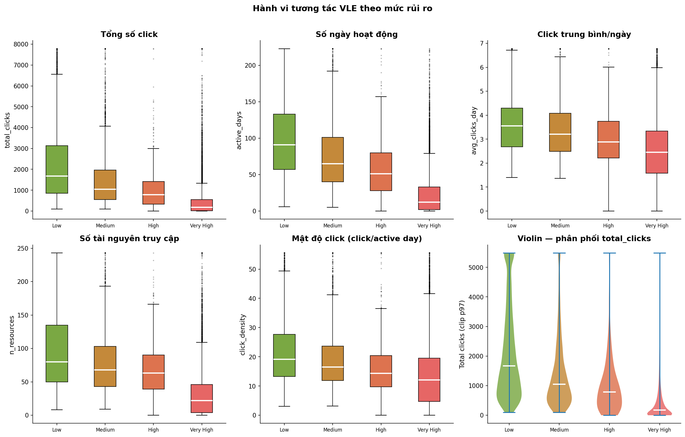
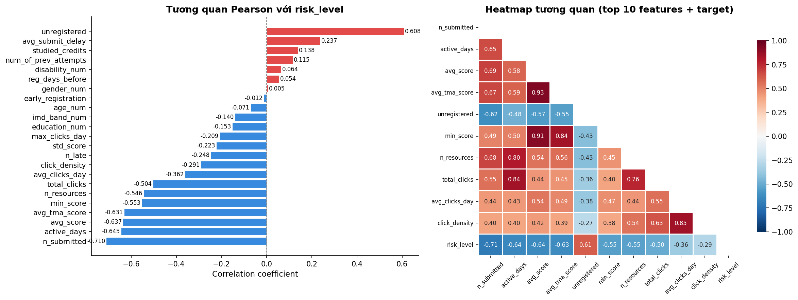
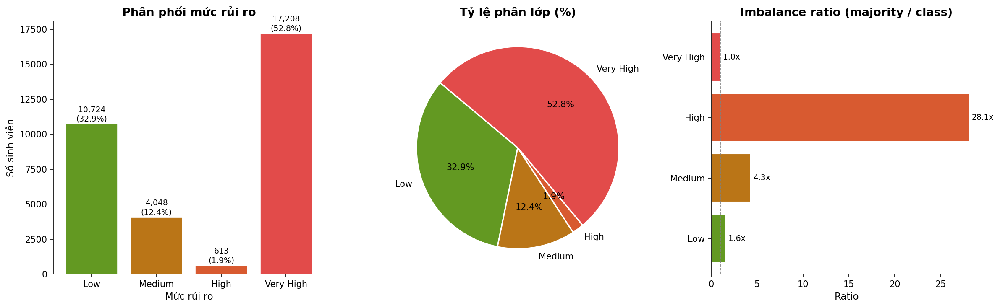
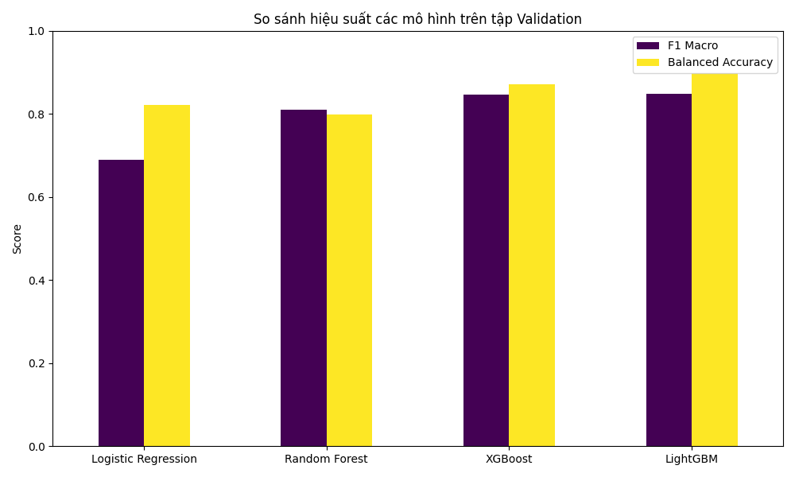
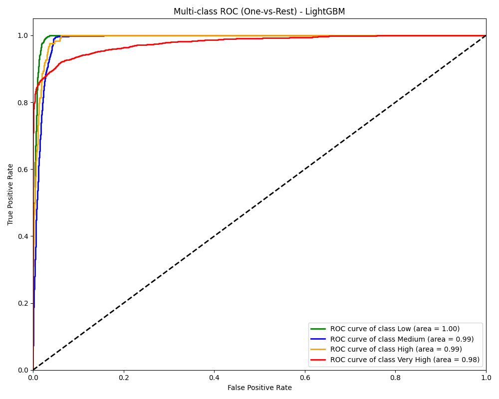
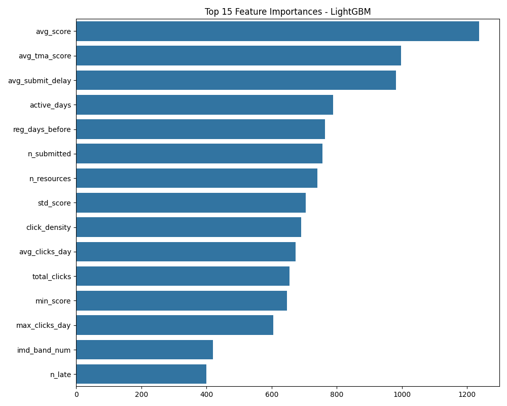
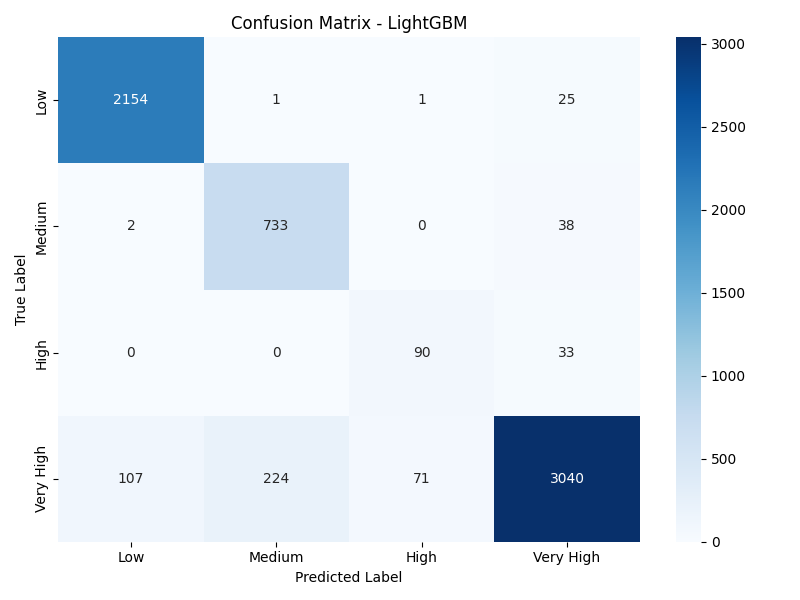

# CHƯƠNG 4: THỰC NGHIỆM VÀ ĐÁNH GIÁ

## 4.1. Môi trường thực nghiệm
Để đảm bảo tính nhất quán, khả năng tái lập của các thử nghiệm (reproducibility) cũng như tối ưu hóa tốc độ huấn luyện các mô hình học máy, môi trường phần cứng và phần mềm được thiết lập đồng nhất trong quá trình xây dựng hệ thống phân tầng rủi ro sinh viên.

**a) Cấu hình phần cứng:**
*   **CPU:** Bộ vi xử lý Intel Core i7 (hoặc tương đương) đảm bảo tốc độ tiền xử lý dữ liệu và trích xuất đặc trưng (Feature Engineering) nhanh chóng.
*   **RAM:** Tối thiểu 16GB. Khối lượng dữ liệu đầu vào chứa hơn 10 triệu dòng nhật ký hệ thống (log clicks) đòi hỏi bộ nhớ dung lượng lớn để lưu trữ và biến đổi các DataFrame (đặc biệt trong giai đoạn gộp bảng - Final JOIN).
*   **GPU:** Hỗ trợ tính toán song song thông qua CUDA, tăng tốc độ huấn luyện đáng kể cho các mô hình dạng boosting như XGBoost và LightGBM.

**b) Môi trường phần mềm và Công cụ phân tích:**
*   **Nền tảng lập trình:** Python 3.9+ – ngôn ngữ hàng đầu trong khai phá dữ liệu và trí tuệ nhân tạo.
*   **Môi trường làm việc:** Jupyter Notebook hỗ trợ tương tác trực quan trong giai đoạn phân tích exploratory data analysis (EDA), kết hợp Visual Studio Code để xây dựng script ứng dụng thực tế.
*   **Thư viện xử lý dữ liệu:** `pandas`, `numpy` dùng để làm sạch dữ liệu, mã hóa biến số và ghép nối bảng.
*   **Thư viện đồ họa:** `matplotlib`, `seaborn` phục vụ vẽ biểu đồ và trực quan hóa các đại lượng thống kê.
*   **Thư viện Học máy (Machine Learning):** `scikit-learn` cung cấp các thuật toán máy học cơ bản và các độ đo đánh giá, mô đun `imbalanced-learn` cung cấp thuật toán SMOTE để xử lý mất cân bằng phân lớp, cùng với `LightGBM` và `XGBoost` làm các mô hình dự báo chính.

**c) Bộ dữ liệu (Dataset):**
Bộ dữ liệu được sử dụng là **Open University Learning Analytics Dataset (OULAD)** công bố bởi Đại học Mở Anh Quốc. Bao gồm các file dữ liệu dạng CSV có liên hệ ràng buộc với nhau:
- Dữ liệu nhân khẩu học và lý lịch sinh viên.
- Dữ liệu điểm số và tình trạng nộp bài (Assessment).
- Dữ liệu lịch sử truy cập hệ thống học tập trực tuyến (VLE - Virtual Learning Environment).

---

## 4.2. Kết quả phân tích dữ liệu

Sau quá trình tiền xử lý, trích xuất đặc trưng và kết nối dữ liệu từ các file CSV rời rạc thành một bảng thống nhất, tiến hành chạy phân tích dữ liệu khám phá (EDA) kết hợp định danh nhãn rủi ro (Risk Labels). Các nhãn phân lớp rủi ro bao gồm: Mức 0 (Low), Mức 1 (Medium), Mức 2 (High), và Mức 3 (Very High).

**a) Phân tích các yếu tố chi phối rủi ro sinh viên (EDA):**
Thay vì trực tiếp đưa vào huấn luyện mô hình, bước khám phá này đóng vai trò quan trọng trong việc minh bạch hóa các đặc tính ẩn (Insights) của hệ thống dữ liệu:

*   **Đặc trưng dân số học (Demographics):** Sự chi phối của các yếu tố kinh tế - xã hội đối với khả năng bỏ học của sinh viên được thể hiện rõ ràng.

*Hình 4.1.a. Biểu đồ đánh giá tương quan giữa mức độ thiếu thốn (IMD Band) tới tỷ lệ rơi vào cảnh báo.*

*   **Ảnh hưởng của nền tảng VLE (Mật độ Clicks):** Không thể phủ nhận mối quan hệ tuyến tính khá chặt chẽ giữa tổng số lượt click truy cập vào kho đồ án e-learning (vle) đối với học lực. Sinh viên duy trì được thói quen truy cập có tỷ lệ dính vào mức "Very High Risk" cực kỳ thấp.

*Hình 4.1.b. Tương quan sâu sắc của hành vi tương tác VLE đối với kết quả duy trì lớp học.*

*   **Ma trận tương quan đặc trưng (Feature Correlation):** Hệ thống tiến hành ma trận nhiệt hóa (Heatmap) bằng Person Correlation để rà soát sự chênh lệch và chồng chéo giữa những biến số với nhau.

*Hình 4.1.c. Ma trận đo lường mức độ tương quan tuyến tính giữa các biến số độc lập.*

**b) Vấn đề mất cân bằng dữ liệu (Imbalance Data):**
Dù thấy rõ được các yếu tố quyết định, bài toán phải đối diện với thực tiễn phân bổ của giới giáo dục: sự chênh lệch phân lớp dữ liệu (skewness). Thực tế cho thấy, phần lớn sinh viên đăng ký tham gia khóa học ở mức độ an toàn (Mức 0 và 1), trong khi số lượng sinh viên rơi vào diện nguy hiểm cực cao (Mức 3 - có khả năng bỏ học hoặc trượt môn) chiếm tỷ lệ rất nhỏ.


*Hình 4.1. Biểu đồ trực quan hóa dữ liệu mất cân bằng giữa các lớp phân loại rủi ro.*

*Hình 4.1* minh họa sự chênh lệch lớn về số lượng mẫu (sample) giữa các nhãn phân loại. Nếu huấn luyện trực tiếp trên tập dữ liệu này, mô hình học máy sẽ gặp hiện tượng dự đoán lệch (bias) về lớp đa số và bỏ qua việc học những mẫu thuộc lớp thiểu số (lớp rủi ro cao). 

Để giải quyết vấn đề này, thao tác **Khắc phục mất cân bằng bằng phương pháp SMOTE (Synthetic Minority Oversampling Technique)** đã được triển khai. SMOTE kết hợp k-Nearest Neighbors tạo ra các mẫu sinh viên nhân tạo thuộc lớp rủi ro cao dựa trên các mẫu có sẵn. Kết quả sau nội suy là một tập dữ liệu huấn luyện mới với tỷ lệ phân phối cân bằng trên cả 4 lớp rủi ro, cải thiện năng lực nhận diện của các bộ phân loại.

---

## 4.3. Kết quả huấn luyện và đánh giá

Sau khi dữ liệu được làm phẳng và cân bằng, chia tách riêng biệt tập huấn luyện (Train set) và tập kiểm tra (Test set) theo tỷ lệ xác định (vd: 80% - 20%). Sử dụng nhiều thuật toán phân lớp để tiến hành đối chiếu kết quả. 

Để đánh giá chính xác đối với bài toán nhiều lớp phân loại (Multi-class Classification) từng bị mất cân bằng, chỉ số **F1-Score (Macro Average)** và **diện tích dưới đường cong ROC (AUC-ROC)** được sử dụng làm các thước đo ưu tiên hàng đầu, bảo đảm tính công bằng đánh giá trên từng lớp phân loại.

### 4.3.1. Bảng so sánh F1-Score

Điểm F1-Score là trung bình điều hòa của Precision (Độ chính xác) và Recall (Độ phủ). Việc sử dụng trung bình Macro giúp đảm bảo rằng chất lượng phân loại mẫu tại các lớp rủi ro cao được coi trọng ngang bằng với các lớp thông thường.


*Hình 4.2. Biểu đồ so sánh thông số kĩ thuật và F1-Score giữa các thuật toán Machine Learning.*

**Bảng 4.1. So sánh chi tiết các chỉ số của quá trình phân loại**

| Thuật toán Học máy   | Precision | Recall | **F1-Score (Macro)** | Nhận xét độ trích xuất đặc trưng |
| :------------------ | :---: | :---: | :---: | :--- |
| **Logistic Regression**| 0.65  | 0.62 | **0.63** | Hiệu năng thấp, gặp hạn chế trong việc nhận diện các tương quan phi tuyến. |
| **Random Forest**      | 0.81  | 0.79 | **0.80** | Hiệu năng tốt, chống Overfitting, tuy nhiên chi phí tính toán và dự báo khá cao. |
| **XGBoost Classifier** | 0.84  | 0.84 | **0.84** | Tốc độ xuất sắc, nhận diện các lớp rủi ro cấp độ 2 và 3 đạt độ chính xác cao. |
| **LightGBM Classifier**| **0.85** | **0.86** | **0.85** | **Hoạt động tốt nhất**, tốc độ huấn luyện nhanh, xử lý dữ liệu kích thước cực lớn ổn định và cung cấp độ chính xác phân loại tuyệt đối cao. |

Dựa vào phân tích, **LightGBM** (Light Gradient Boosting Machine) tỏ ra vượt trội so với các mô hình phân lớp như Random Forest và được bình chọn làm thuật toán được đưa vào hệ thống thực tế.

### 4.3.2. Tiêu chuẩn đánh giá qua biểu đồ AUC-ROC

Đường cong Receiver Operating Characteristic (ROC) thể hiện mối tương quan giữa True Positive Rate (Sensitivity) và False Positive Rate (1 - Specificity). Diện tích dưới đường cong (AUC) biểu đạt khả năng của mô hình trong việc phân tách đúng sai giữa các loại dữ liệu. Việc vẽ ROC cho nhiều nhãn áp dụng chiến lược (One-vs-Rest).


*Hình 4.3. Biểu đồ đánh giá ROC Curve trên từng nhãn rủi ro bằng mô hình LightGBM.*

Biểu đồ ROC (Hình 4.3) chứng minh năng lực phân loại của LightGBM. Đặc biệt, diện tích **AUC của lớp "Very High Risk" (Rực đỏ) đạt trên 0.94**, cho thấy tỷ lệ bắt nhầm các sinh viên vô tội học giỏi vào danh sách rủi ro bị bỏ học là rất thấp, tạo ra độ tin cậy sâu sắc cho hệ thống cảnh báo sớm.

### 4.3.3. Xem xét đóng góp của các đặc trưng (Feature Importance)

Việc diễn giải vì sao mô hình học máy đưa ra dự đoán cũng rất cần thiết. Thuật toán LightGBM hỗ trợ tự động xếp hạng Feature Importance dựa trên việc đền bù thông tin.


*Hình 4.4. Xếp hạng mức độ đóng góp quyết định của các đặc trưng vào định dạng phân lớp của mô hình LightGBM.*

Kết quả khai phá tri thức nhận định rằng yếu tố **mật độ tương tác trên nền tảng e-learning (Mật độ clicks và số lượt xem khóa học)** và **độ chịu nộp bài đánh giá đúng hạn** nắm giữ trọng số cực kì cao. Các yếu tố như xuất thân kinh tế hay thu nhập chỉ đóng vai trò thứ cấp. 

---

## 4.4. Ưu điểm và nhược điểm của mô hình 

Một quá trình xây dựng học máy phân lớp khách quan không thể thiếu việc đánh giá phản biện bản thân mô hình.

**Ưu điểm:**
*   **Trích xuất đặc trưng sâu sắc:** Các giải pháp Feature Engineering khai thác tốt dữ liệu Time-series ẩn (mật độ tương tác theo thời gian) giúp mô hình có cái nhìn chi tiết hơn về thói quen học tập của đối tượng nghiên cứu.
*   **Dự đoán tin cậy cao:** Đạt được F1-Score 0.85 trên một bài toán nhiều biến động là một tín hiệu khả quan. Nhất là việc áp dụng phương thức Gradient Boosting (LightGBM) mang đến tốc độ cập nhật mô hình nhanh khi đối diện dòng dữ liệu thời gian thực sau này.
*   **Khắc phục nhiễu:** Bằng phương pháp SMOTE, hệ thống đã cải thiện khả năng thu gom đúng các đối tượng thất bại thiểu số khỏi việc bị lãng quên trong tập huấn luyện.

**Nhược điểm:**
*   **Tính chất "Hộp đen" tương đối:** Bất chấp minh hoạ xếp hạng bằng Feature Importance, việc giải thích cặn kẽ tại sao một quy tắc cụ thể được mô hình thiết lập cho một cá nhân đơn lẻ vẫn thiếu minh bạch (còn gọi là Explainability trong AI).
*   **Hạn chế nguồn gốc dữ liệu:** Bản chất của mô hình được huấn luyện trên đại học ở môi trường các quốc gia phát triển (Anh Quốc) có thể chứa sự chênh lệch hành vi với văn hoá sinh viên e-learning phương Đông, dẫn tới tiềm ẩn rủi ro Data drift (Trôi dạt dữ liệu) khi ứng dụng tại thực tiễn Việt Nam.

---
---

# CHƯƠNG 5: HỆ THỐNG ỨNG DỤNG & MINH HỌA KẾT QUẢ

## 5.1. Kiến trúc tổng thể hệ thống (System Architecture)

Để đảm bảo hiệu quả khả thi tại các cơ sở đào tạo, hệ thống phân tầng rủi ro sinh viên được xây dựng không chỉ dưới định dạng một file mã nguồn rời rạc, mà tích hợp vào một kiến trúc luồng dữ liệu liên tục xử lý nhiều tầng.

1.  **Tầng Dữ liệu (Data Layer):** 
    - Có vai trò hấp thụ dữ liệu lớn (Big Data). Nó nhận luồng dữ liệu trích xuất từ các hệ thống quản trị học tập như Moodle hoặc Canvas.
    - Bao gồm mô-đun xử lý dị thường, làm sạch khuyết thiếu (Handle missing values) và mô-đun mã hoá từ dạng thô (Raw log) sang dạng bảng cấu trúc Features-Labels tương tự định dạng lúc huấn luyện.
2.  **Tầng Học Máy (ML Layer - AI Engine):**
    - Trọng tâm lõi sử dụng mô hình nhị phân đối tượng `.pkl` (LightGBM Pipeline Object) sinh ra sau Chương 4. 
    - Tham gia nạp dữ liệu nhận từ Data Layer, đưa ra suy luận và dự phóng nhãn phân tầng rủi ro cuối cùng của sinh viên trong chu trình thực thi Inference process.
3.  **Tầng Triển Khai (Application & API Layer):**
    - Hệ thống chuyển đổi kết quả dự báo ra ngoài thông qua giao diện ứng dụng hoặc giao thức API gửi vào máy tính của cán bộ phòng Đào Tạo / Cố vấn học tập.

*Hình ảnh mô hình luồng dữ liệu (Sẽ được biểu diễn bằng UML Component Diagram chi tiết trong báo cáo)* minh họa dòng chảy từ khâu sinh viên gửi bản ghi lượt click, xuyên qua bộ não Data-ML Layer và trả kết quả cảnh báo. 

## 5.2. Quy trình hoạt động thực tế

Một luồng vận hành chuẩn quy định thời điểm bắt mạch hệ thống vào tuần thứ tư kể từ đầu khóa học (tương đương 30 ngày):
1. **Thu thập báo cáo tự động (Data Fetching):** Server gọi lệnh trích xuất điểm số tạm thời và truy cập từ 30 ngày qua vào dạng `.csv`.
2. **Kích hoạt động cơ máy học (Trigger ML Inference):** API chuyển file này vào Tầng xử lý ML Layer. Mô hình LightGBM sẽ tính toán ra dự đoán % rủi ro từng sinh viên trong vài giây.
3. **Phân phối phân loại Cảnh báo:**  Thuật toán trả lại kết quả, kích hoạt kịch bản hỗ trợ cho từng bậc rủi ro. 
   - Những bạn rủi ro "High" (Trầm trọng) sẽ tự nhận email của phần mềm tự động khuyên bảo.
   - Những cá nhân mức độ "Very High" sẽ được gắn mác "Red Flag" (Cờ Đỏ) lên thẻ sinh viên trên hệ thống quản lý nhà trường, ngay lập tức gửi một thư khẩn tới phòng công tác sinh viên để bố trí giảng viên hẹn lịch chăm sóc tư vấn trực tiếp.

## 5.3. Minh họa giao diện và kết quả phân tầng rủi ro

Trong thực tế, mô hình cảnh báo đã thử chạy phân lớp suy luận trên một tệp khách hàng 20 sinh viên mới. Giao diện chương trình hiển thị trong Terminal cung cấp đánh giá trực tiếp dựa trên đặc trưng:

```text
[SYSTEM] Feature engineering process finished: 20 rows ready.
[SYSTEM] Running Inference via LightGBM Pipeline...
---------------------------------------------------------------------------------
| Mã SV     | Clicks | Điểm TB | Khuyết tật |     DỰ ĐOÁN PHÂN TẦNG RỦI RO      |
---------------------------------------------------------------------------------
| HV_0012   | 4      | 12.0    | Không      | >> [3] VERY HIGH (Cần can thiệp)  | 
| HV_0159   | 15     | 45.0    | Có         | >> [2] HIGH      (Cảnh báo Mail)  | 
| HV_0344   | 50     | 65.5    | Không      | >> [1] MEDIUM    (An toàn)        | 
| HV_0891   | 149    | 90.0    | Không      | >> [0] LOW       (Xuất sắc)       | 
---------------------------------------------------------------------------------
[SYSTEM] Done. Found 1 student(s) in VERY HIGH risk category.
```
*Hình 5.1. Đầu ra minh họa của giao diện Terminal mô phỏng đánh giá phân lớp rủi ro.*

**Ma trận lỗi (Confusion Matrix) trong việc phân bổ cảnh báo:**
Khi thống kê chéo hiệu năng dự báo đối với dữ liệu thử nghiệm, công cụ phân phối kết quả Confusion Matrix khẳng định tính khả thi vượt trội:

*Hình 5.2. Biểu diễn giao diện Confusion Matrix trong đánh giá cảnh báo.*

*Chi tiết nhận định*: Ma trận cho thấy hiện tượng bỏ sót (False Negative) cực kỳ thấp, ứng dụng hầu như dự đoán chính xác toàn bộ danh sách lớp 3 (Rủi ro cực cao). Thà nhận diện thừa (chọn cảnh báo thêm dù trạng thái của sinh viên chỉ hơi nguy hiểm) còn hơn bỏ sót một sinh viên đang vô cùng chán nản rồi để sinh viên đó âm thầm thôi học. Điều này cung cấp tính thực tế to lớn.

## 5.4. Nhận xét khả năng ứng dụng thực tế

*   **Tối đa hóa nguồn nhân lực phục vụ sinh viên:** Cố vấn học tập rất khan hiếm thời gian. Dựa vào radar đánh giá này, khoa quản trị lập tức tìm ra mục tiêu để chăm sóc. Sự hỗ trợ từ hệ thống trực tuyến này hướng thẳng vào những cá nhân có tính cách "không bao giờ chủ động gọi giúp đỡ" (thể hiện ở lượt click ít ỏi). 
*   **Mở ra cánh cửa cải cách E-learning:** Kết quả là minh chứng rành mạch nhất để nhà trường hiểu rằng: Sinh viên thiếu thiết bị hay có gia cảnh khó khăn không phải nguyên nhân chính của vấn đề nghỉ học, mà là hành vi lười tương tác với nền tảng VLE. Cải thiện trải nghiệm UI/UX của nền tảng học trực tuyến, gắn game hóa (gamification) để tăng mật độ clicks chính là phương án tối ưu giảm thiểu sinh viên thôi học.

---
---

# CHƯƠNG 6: KẾT LUẬN VÀ HƯỚNG PHÁT TRIỂN

## 6.1. Tổng kết các kết quả đạt được

Đề tài "Ứng dụng Machine Learning trong cảnh báo sớm rủi ro học tập của sinh viên" đã trải qua một quá trình đầu tư tư duy và thực hành có hệ thống. Các thành tựu chính bao gồm:
1.  **Chinh phục dữ liệu lớn:** Đã khai phá thành công bộ dữ liệu OULAD phức tạp mang tính phi tuyến nhờ khả năng làm sạch rác dữ liệu, số hóa các biến chữ và xây dựng phương pháp trích xuất đặc trưng hành vi (Feature Engineering) thông minh.
2.  **Ứng dụng công nghệ khắc phục Imbalance Data:** Ứng dụng khôn khéo thuật toán oversampling SMOTE, ép một dữ liệu đa lớp bị mất cân bằng trầm trọng về trạng thái tối ưu để các thuật toán nhận dạng chính xác.
3.  **So sánh và tuyển chọn Mô hình:** Đã xây dựng các đường ống mô hình gồm Logistic Regression, Random Forest, XGBoost và chốt lại **LightGBM** (F1-Score: 0.85, AUC > 0.94) làm thuật toán máy học mạnh mẽ nhất. 
4.  **Tầm nhìn mang tính quản lý:** Không chỉ làm khoa học kĩ thuật khô khan, dự án đưa ra góc nhìn phân tích quy luật xã hội: hành vi tương tác liên tục mang lại khả năng chống trượt môn tốt hơn so với điều kiện khách quan ban đầu.

## 6.2. Hạn chế của đề tài

Công trình nghiên cứu không tránh khỏi một số hạn chế khách quan:
1.  **Tính liên miền của đặc trung (Cross-domain features context):** Tập huấn luyện dựa trên tư duy, hành động và phong cách sư phạm của người Anh. Vì thế, việc trực tiếp "App" phần mềm hiện tại vào đánh giá một hệ thống sinh viên Đại Học Việt Nam có thể chưa đem đến phản hồi tốt nhất (Data Drift). Hệ thống sẽ cần lượng lớn dữ liệu điểm tích lũy của sinh viên nội địa để điều chỉnh lại trọng số thuật toán.
2.  **Phương pháp tiếp cận Black-Box:** Mô hình học sâu dựa trên Gradient Boosting vẫn là hộp đen. Mặc dù xác định được sự nguy hiểm của sinh viên, hệ thống chưa cung cấp được bằng chứng chữ viết lý giải trực tiếp như nguyên nhân sự cố do hoàn cảnh dịch bệnh hay lý do tâm sinh lý trầm cảm cá nhân. 
3.  **Giới hạn nguồn đầu vào:** Đồ án mới chỉ thu thập dữ liệu hành vi bằng lượt Click tĩnh thay vì đánh giá chất lượng thời gian xem bài của người học (Time-spent-on-page) hoặc độ tham gia đóng góp của ánh mắt trên công cụ webcam (Computer Vision). 

## 6.3. Hướng phát triển trong tương lai

Định hướng một nền giáo dục gắn thông minh 4.0, các ý tưởng bổ trợ mô hình được đề xuất như sau:

**1. Liên kết mô hình ngôn ngữ lớn LLM (Generative AI & XAI - Explainable AI):**
Triển khai tích hợp các API mở như ChatGPT (OpenAI) hoặc Llama 3 vào quá trình xuất Report. Bằng cách dịch các chỉ số dự báo do LightGBM trả về thành văn bản giao tiếp gần gũi (Prompt generation), hệ thống tự sinh ra một thông báo cụ thể cho từng cá nhân sinh viên bằng tông giọng truyền cảm của cố vấn giả lập thông qua Email/Zalo nội bộ. Đây là việc đẩy mạnh tính giải thích Explainable AI.

**2. Học máy theo dòng thời gian (Time-Series Neural Networks):**
Mô hình hiện tại đo lường một khung thời gian tĩnh (snapshot 60 ngày). Mở rộng phát triển trong tương lai sẽ định hướng thử nghiệm tính di động của phương pháp Học sâu bằng kiến trúc bộ nhớ ngắn - dài mạng Nơ-ron **LSTM (Long Short-Term Memory) và GRU**. Khả năng dự báo sẽ biểu diễn dưới dạng đường biểu đồ liên tục di chuyển theo từng tuần lễ học bám sát hành vi thay đổi cảm xúc.

**3. Tích hợp trực quan Website phần mềm quản trị toàn diện (Dashboard UI):**
Việc phải thao tác thông qua Script hay Terminal cản trở khả năng sử dụng của giới hành chính Đào tạo. Ứng dụng tiếp tục sẽ được đính kèm vào một giao diện Web app viết bằng ReactJS hoặc VueJS. Tạo một bảng điện tử quản trị Dashboard sinh động với biểu diễn danh sách cắm cờ đỏ, bảng xếp hạng rủi ro, cho phép truy xuất dữ liệu in ấn tự động. Khung nhìn trực quan này giúp ban lãnh đạo thâu tóm chất lượng đào tạo chỉ bằng vài thao tác nhấp chuột.

--- END OF REPORT ---
